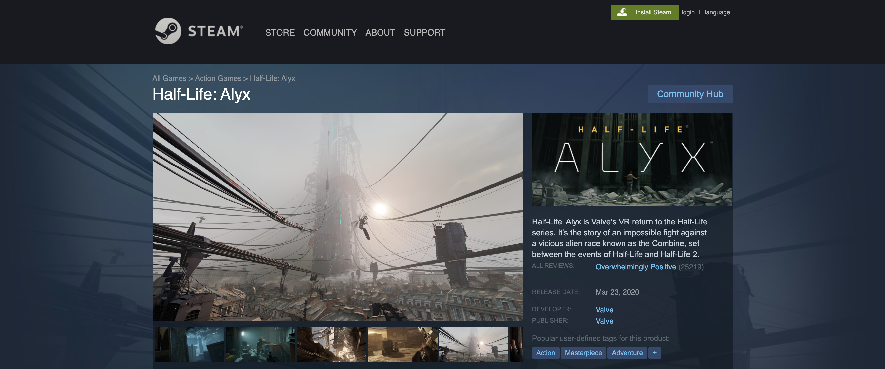

# Steamy
Proxy for the 4 microservices linked to Steamy, a replication of the popular e-commerce site.

### Media
* Media module displaying relevant images and videos for each game

- https://github.com/Team-Gandalf/Media

### Announcements
* Interactable modules with news regarding the game or from the developers

- https://github.com/Team-Gandalf/announcements

### Sidebar and Related Body
* All information regarding the game, as well as related games you may enjoy

- https://github.com/Team-Gandalf/sidebar-body-related

### Reviews
* User interactable reviews component from gamers that played the product themselves.

- https://github.com/Team-Gandalf/Steamy-Reviews-Service

## Getting started

- Run `npm start` on your command line.

## Technology stack

> A full stack react app built with the philosophy of continuously-integrated, test-driven development.

- CSS
- HTML5
- Node.js
- Express
- MongoDB

### Installing Dependencies

From within the root directory:

```sh
npm install
```

## Development

From within the root directory:

To run server

```sh
npm run start:dev
```
